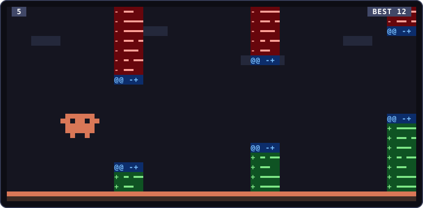

<h1 align="center">Flappy Code</h1>

<p align="center">
  <b>Flappy Bird for the moments when Claude is thinking.</b><br>
  Fly the Claude mascot through diff hunks, right inside <a href="https://claude.com/claude-code">Claude Code</a>.
</p>

<p align="center">
  
</p>

## Get it

```bash
claude plugin marketplace add fixter-dev/flappy-code
claude plugin install flappy@flappy-code
```

Then type `/flappy` and start jumping.

Just want a quick look? Run it straight from a clone instead:

```bash
git clone https://github.com/fixter-dev/flappy-code.git
claude --plugin-dir ./flappy-code
```

> Flappy Code is a Claude Code *mod*. Mods are still early access, so you need a build of
> Claude Code that has them switched on.

## How to play

- **Space** jumps. So do Enter and any letter key.
- **Click the game** to jump too. A click also hands the game your keyboard directly, which makes
  it feel noticeably snappier.
- **Esc** quits. Press it twice if you clicked the game first.

Slip through the gap between the red removed lines and the green added lines. Clip a hunk and you
get a `MERGE CONFLICT`. Hit the floor and it's `CORE DUMPED`.

## Why you'll like it

- **It doesn't wait for Claude.** `/flappy` opens right away, even in the middle of a turn.
- **It knows when you're bored.** After a minute of thinking, a small line above the prompt asks
  if you fancy a round. Press `1` to play or `2` to wave it off. Prefer it to just open by itself,
  or to stay quiet? Set *When Claude thinks for a minute* to `open` or `off` in `/config`.
- **It remembers your best score** between sessions. `/flappy reset` starts you over.
- **It fits your terminal.** Wide terminals get a tall side pane; drag its edge for a wider
  playfield. Narrow ones get a shorter game above the prompt, with the gap and the jump scaled to
  match.
- **It has a plan B outside the terminal.** Where the game's drawing code can't run, such as the
  desktop app, it draws every frame as a picture instead. That mode is experimental and a little
  slower, but it is the same game.

## Under the hood

The game is split into small files:

- [`hooks/physics.ts`](hooks/physics.ts) is the game itself: gravity, jumps, hunks, collisions and
  scoring, written as pure functions.
- [`hooks/scene.ts`](hooks/scene.ts) paints a game state: two pixels into every character cell,
  using half blocks.
- [`hooks/game.tsx`](hooks/game.tsx) runs the game on Claude Code's drawing thread in the terminal.
- [`hooks/picture.ts`](hooks/picture.ts) turns the same scene into an SVG for surfaces that can't
  run the drawing code.
- [`hooks/register.tsx`](hooks/register.tsx) wires it into Claude Code: the `/flappy` command, the
  pane, the nudge above the prompt and the saved best score.

## Hacking on it

```bash
claude plugin validate .   # check the manifest and the hooks
claude plugin test .       # run the tests
```

If the game doesn't show up somewhere, `/flappy debug` reports, for each surface, how big the pane is
and whether the drawing code is running there.

Pull requests and silly ideas are welcome.

## License

[MIT](LICENSE). Flappy Code is a fan project and is not affiliated with or endorsed by Anthropic.
